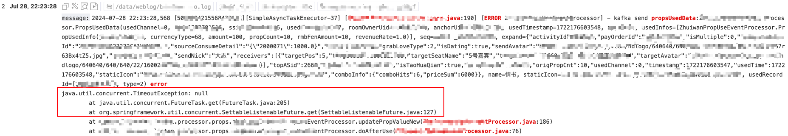
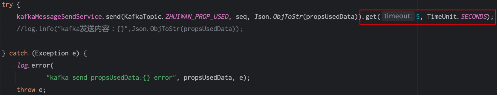
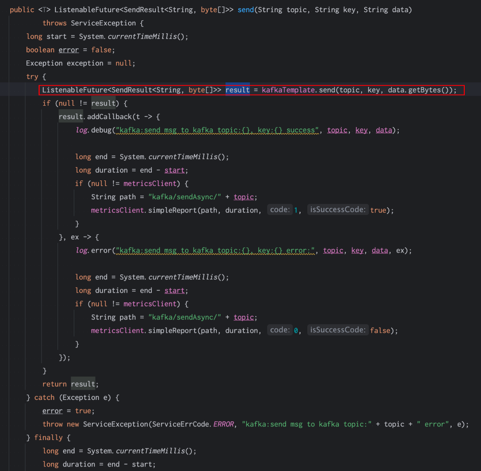
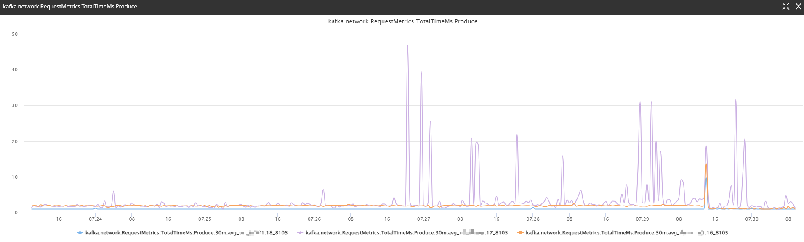

问题：这2天写kakfa经常出现超时，超时设置5秒

代码逻辑：通过spring的kafkaTemplate，然后timeout 5秒

2. 应用层分析：
- CPU，内存，磁盘IO，网络，JVM没发现特别变化，包括容器和宿主机
3. 运维分析：
  应该跟你们业务没有关联。
  初步调查，目前三台机器上有一台机器的其中一个磁盘io相对较高，看起来是有其他两个业务的kafka在该磁盘占用数据量过大，可能这两个业务的分区不够均衡或者分片太少，造成落到了单个磁盘io较高。
  我们现在先准备对这两个业务进行分区调整和扩容。
4. Kafka服务端的监控（可以看到有一台写数据很慢）

5. IO异常的证据？
