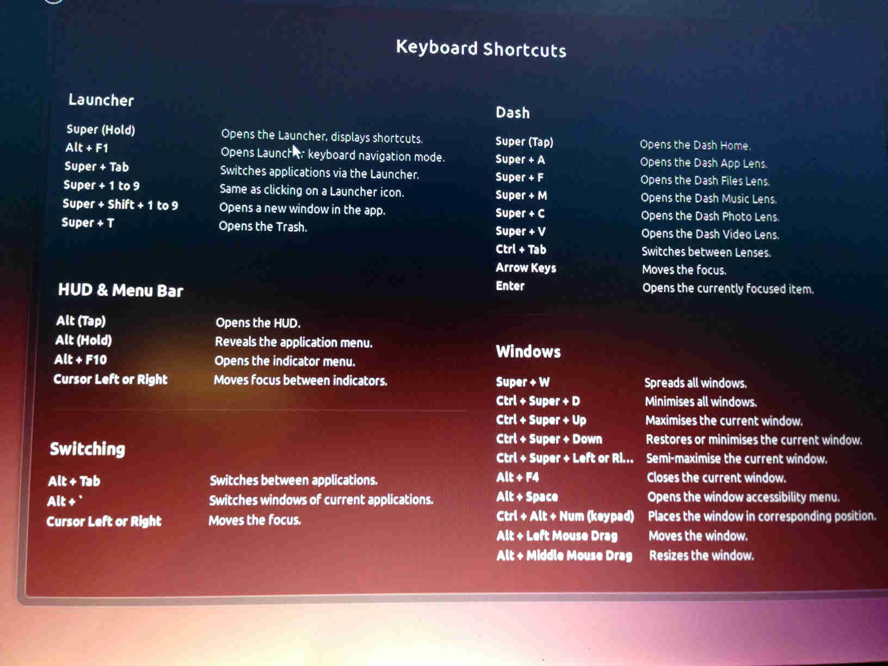

## 打开运行对话框
`alt + F2`

## 截图
```
PrtSc – 获取整个屏幕的截图并保存到 Pictures 目录。
Shift + PrtSc – 获取屏幕的某个区域截图并保存到 Pictures 目录。
Alt + PrtSc –获取当前窗口的截图并保存到 Pictures 目录。
Ctrl + PrtSc – 获取整个屏幕的截图并存放到剪贴板。
Shift + Ctrl + PrtSc – 获取屏幕的某个区域截图并存放到剪贴板。
Ctrl + Alt + PrtSc – 获取当前窗口的 截图并存放到剪贴板。
```

## Other
