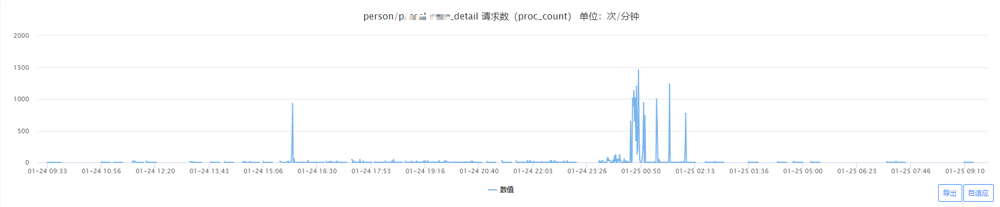

## 一次慢日志的分析过程
- 时间：Jan 25, 2024, 00:35:00 ~ Jan 25, 2024, 00:45:00
- 现象：发现有大量接口超时
- 初步分析：发现有大量慢日志
- 详细分析
  - 方案1：分析慢日志中的罪魁祸首，这里可以使用工具percona-toolkit，但是要dba才能操作
  - 方案2：人肉在dba提供的慢日志页面上分析sql，太多了看不过来
  - 方案3：从业务侧结合经验分析
    - 看到有一个接口的请求量突发暴涨，如下图
      - 
    - 分析对应的SQL是否在慢日志中，结论是有的
    - 分析SQL的优化空间，通过explain分析并找到优化点，创建更合适的索引
      - 分析暴涨的原因，这里猜测是恶意攻击，通过进一步分析统计来源IP，确认是恶意攻击
- 解决方案
  - 分布式限流：限制单IP和全局的访问量，这里还踩了一个坑：公司的分布式限流估计有BUG，单IP看起来没能限制住。
  - 应用层自己按Path限流
  - 应用层该接口加用户串行锁