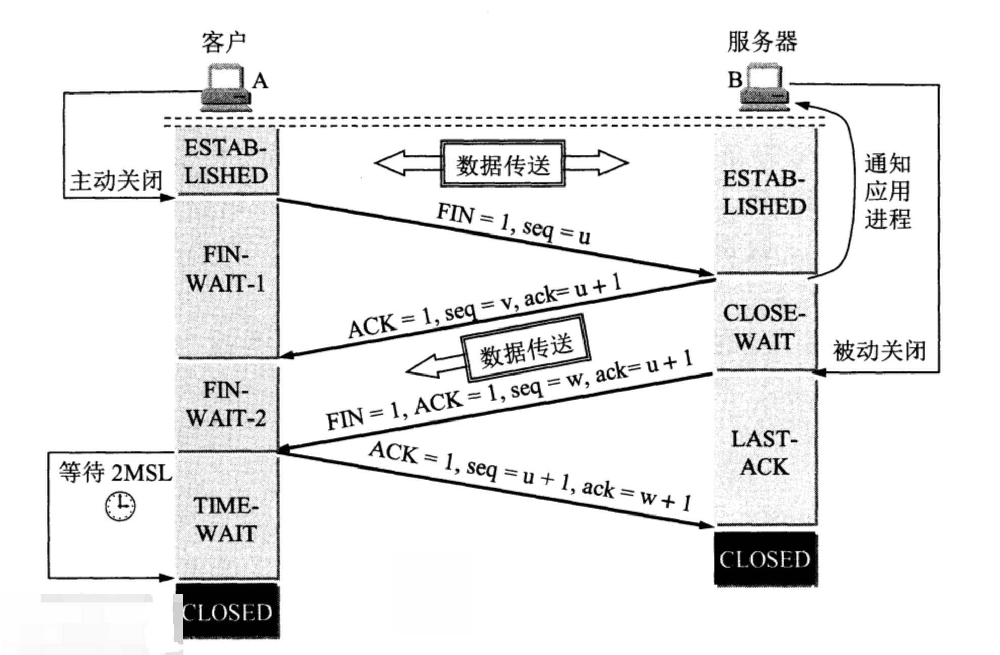

## 2MSL
2MSL是指两倍最长报文段寿命（Two Maximum Segment Lifetime）的缩写。在TCP/IP协议中，MSL是指TCP报文段在网络中存活的最长时间。当TCP连接的一方发送FIN（结束）报文段后，它会进入TIME_WAIT状态，并等待2MSL的时间才会关闭连接。

2MSL的目的是为了确保网络中所有可能存在的旧报文段都能够被丢弃，以避免对后续连接的影响。在TCP连接关闭后，MSL的时间段内可能仍然存在网络中的延迟、重传等问题，如果新的连接使用了旧连接的端口和IP地址，可能会收到之前连接遗留的报文段。通过等待2MSL的时间，可以确保网络中的所有旧报文段都被丢弃，从而避免这种问题。

2MSL的具体时间取决于实现的TCP/IP协议栈，通常为30秒至2分钟之间。在这段时间内，TCP连接的一方会继续等待，确保网络中没有旧报文段存在，然后才会关闭连接，释放相关的资源。

### 查看MSL值
sysctl net.ipv4.tcp_fin_timeout  
net.ipv4.tcp_fin_timeout = 60 // 表示60秒

## TCP_NODELAY
sock.setTcpNoDelay(true);  

Rudy：简单讲，Delay的好处牺牲性能提升吞吐量，所以高性能的场景就不要delay了。

在默认情况下，客户端向服务器发送数据时，会根据数据包的大小决定是否立即发送。当数据包中的数据很少时，如只有1个字节，而数据包的头却有几十个字节（IP头+TCP头）时，系统会在发送之前先将较小的包合并到软大的包后，一起将数据发送出去。在发送下一个数据包时，系统会等待服务器对前一个数据包的响应，当收到服务器的响应后，再发送下一个数据包，这就是所谓的Nagle算法；在默认情况下，Nagle算法是开启的。

这种算法虽然可以有效地改善网络传输的效率，但对于网络速度比较慢，而且对实现性的要求比较高的情况下（如游戏、Telnet等），使用这种方式传输数据会使得客户端有明显的停顿现象。因此，最好的解决方案就是需要Nagle算法时就使用它，不需要时就关闭它。而使用setTcpToDelay正好可以满足这个需求。当使用setTcpNoDelay（true）将Nagle算法关闭后，客户端每发送一次数据，无论数据包的大小都会将这些数据发送出去。

## SO_REUSEADDR
socket.setReuseAddress(true); 

Rudy：简单讲，TIME_WAIT（2MSL）其实就是为了防止旧数据对新连接的影响。
所以对于服务端的监听端口，重启后其实直接复用是没有问题了。其他场景还是需要谨慎考虑。（zookeeper的监听端口就是可以reuse的，要不每次服务端重启要等2分钟）

TIME_WAIT状态是TCP协议的一种状态，它在TCP连接关闭后的一段时间内保持存在。TIME_WAIT状态的主要用途如下：

完整性保证：TIME_WAIT状态的存在确保了TCP连接的完整性。在该状态下，TCP协议会等待一段时间（通常是2倍的MSL，Maximum Segment Lifetime，即最大报文段生存时间），以确保网络中可能延迟到达的数据报文已经被丢弃，避免了旧数据对新连接的影响。

可靠连接关闭：TIME_WAIT状态允许TCP连接的双方都能够在连接关闭后继续发送报文，以确保双方都能够正常执行连接关闭的完成握手过程。这是为了防止旧连接的尾部报文在网络中滞留，并被错误地与新的连接关联。

延迟端点重用：TIME_WAIT状态还允许本地端点（包括IP地址和端口号）在一段时间内保持不变，以防止其他主机在这段时间内意外地使用相同的本地端点。这有助于避免端口冲突和连接混乱。

需要注意的是，TIME_WAIT状态的持续时间通常是根据TCP实现的具体配置来确定的，而不是严格由协议规范定义的。常见的持续时间是2分钟（120秒），但也可能根据实现和配置而有所不同。

尽管TIME_WAIT状态有其用途，但在某些情况下，如服务器负载较高或端口资源有限的情况下，过多的TIME_WAIT连接可能导致资源耗尽。在这种情况下，可以通过调整TCP参数或使用SO_REUSEADDR选项来减少TIME_WAIT连接的数量。然而，这需要谨慎评估和考虑，以确保不会对连接的完整性和可靠性产生负面影响。

## tcpKeepAlive
sock.setKeepAlive(tcpKeepAlive);

sysctl -a | grep -a "net.ipv4.tcp_keepalive"
net.ipv4.tcp_keepalive_intvl = 75 // 每75秒探测一次
net.ipv4.tcp_keepalive_probes = 9 // 发送探测没有回应，间隔75秒后不断重试的最大次数
net.ipv4.tcp_keepalive_time = 7200 // 7200秒超时断开连接

tcpKeepAlive（TCP Keep-Alive）是一种TCP协议的机制，用于在长时间没有数据传输的情况下检测和维护TCP连接的活跃状态。它通过周期性地发送空闲探测数据包（Keep-Alive包）来验证远程主机是否仍然可达，以及保持TCP连接的打开状态。

下面是tcpKeepAlive的工作原理：

配置参数：tcpKeepAlive的行为可以通过操作系统的TCP参数进行配置。这些参数通常包括发送Keep-Alive包的间隔时间、重试次数和超时时间等。

空闲检测：当TCP连接处于空闲状态（没有数据传输）一段时间后，操作系统会自动发送一个Keep-Alive包到远程主机。这个时间间隔是由配置参数决定的。

Keep-Alive包格式：Keep-Alive包是一个特殊的TCP数据包，它没有有效负载数据，仅仅是一个空的TCP段。它的目的是让远程主机在收到后发送一个确认响应。

响应检测：如果远程主机仍然可达并且TCP连接保持打开状态，它会发送一个确认响应给发送Keep-Alive包的主机。这个响应表示远程主机仍然活跃。

超时处理：如果在一定时间内没有收到远程主机的确认响应，操作系统会认为TCP连接已经断开或对方不再活跃。在这种情况下，操作系统会关闭TCP连接，并通知应用程序连接已经断开。

通过使用tcpKeepAlive机制，可以检测并处理长时间没有数据传输的TCP连接问题。它可以帮助应用程序及时发现并处理未预料到的连接断开，提高连接的可靠性和稳定性。

## SO_LINGER
socket.setSoLinger(true, 60); // 最多等60秒，然后才close。

这个Socket选项可以影响close方法的行为。在默认情况下，当调用close方法后，将立即返回；如果这时仍然有未被送出的数据包，那么这些数据包将被丢弃。如果将linger参数设为一个正整数n时（n的值最大是65，535），在调用close方法后，将最多被阻塞n秒。在这n秒内，系统将尽量将未送出的数据包发送出去；如果超过了n秒，如果还有未发送的数据包，这些数据包将全部被丢弃；而close方法会立即返回。如果将linger设为0，和关闭SO_LINGER选项的作用是一样的。

如果底层的Socket实现不支持SO_LINGER都会抛出SocketException例外。当给linger参数传递负数值时，setSoLinger还会抛出一个IllegalArgumentException例外。可以通过getSoLinger方法得到延迟关闭的时间，如果返回-1，则表明SO_LINGER是关闭的。例如，下面的代码将延迟关闭的时间设为1分钟：