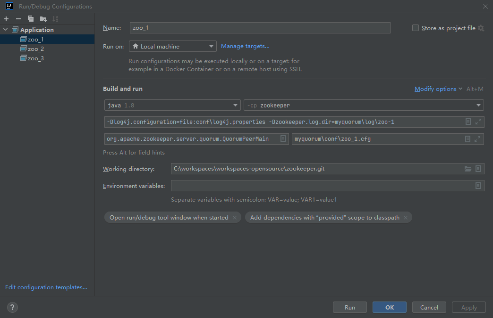

## 源码下载
https://github.com/apache/zookeeper.git

## 源码导入
- 导入IDE
- 切换分支到branch-3.7
- 切换提交到e3704b390a6697bfdf4b0bef79e3da7a4f6bac4b
- mvn clean package -DskipTests

## 创建目录和文件
- myquorum
    - conf
        - zoo_1.cfg
        - zoo_2.cfg
        - zoo_3.cfg
    - data
        - zoo-1
        - zoo-2
        - zoo-3
    - log
        - zoo-1
        - zoo-2
        - zoo-3

## 启动配置

```
Main Class: org.apache.zookeeper.server.quorum.QuorumPeerMain
Argument: myquorum\conf\zoo_1.cfg
VM options: -Dlog4j.configuration=file:conf\log4j.properties -Dzookeeper.log.dir=myquorum\log\zoo-1
```