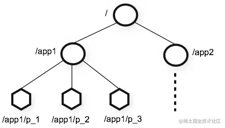
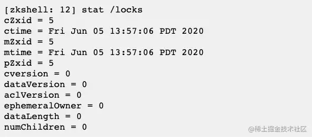
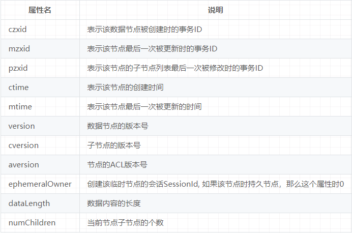

## Znode节点分类

### 持久节点
- 特点： 一旦创建，该数据节点一直会存储在Zookeeper服务器上，即使创建该节点的客户端和服务端会话关闭了，该节点也不会删除。如果想要删除持久节点，就要显示调用delete函数删除。
- 命令： create /persistent_node

### 临时节点
- 特点： 当创建该临时节点的客户端会话因超时或发生异常而关闭时，该节点也相应在 ZooKeeper 服务器上被删除，也可以调用delete主动删除临时节点。
- 命令： create -e /ephemeral_node mydata

### 有序节点
- 特点： 
  - 我们在创建有序节点时，ZooKeeper 服务器会自动使用一个单调递增的数字作为后缀，追加到我们创建节点的后边。
  - 这个序号对于父 znode 是唯一的。计数器的格式为 %010d - 即 10 位数字和 0（零）填充（计数器以这种方式格式化以简化排序），即“0000000001"。
  - 例如一个客户端创建了一个路径为 works/task- 的有序节点，那么 ZooKeeper 将会生成一个序号并追加到该节点的路径后，最后该节点的路径为 works/task-0000000001。
  - 有序节点属性可以和持久或者临时节点共存，意味着有持久有序节点，临时有序节点。
- 命令： 
  - 创建持久有序节点create -s /persistent_sequential_node mydata,
  - 创建临时有序节点create -s -e /ephemeral_sequential_node mydata

### 容器节点
- 3.6.0版本新加
- 特点： 服务端会定期扫描这些节点，当该节点下面没有子节点时（或其他条件时）服务端会自动删除节点
- 命令： create -c /container_node mydata

### TTL节点
- 3.6.0版本新加
- 特点： 需要额外配置才能启用，基本和容器相同，当超过 TTL 时间节点下面都没有再创建子节点时会被删除，但是当创建子节点会重置该超时时间。
- 命令： create -t 3000 /ttl_node mydata

## Znode节点属性

## 具体实现
- DataTree 
- DataNode

## 参考文献
- https://juejin.cn/post/7112015988899938312