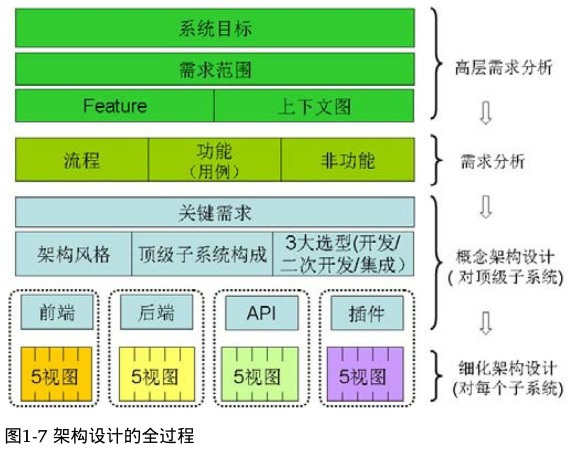
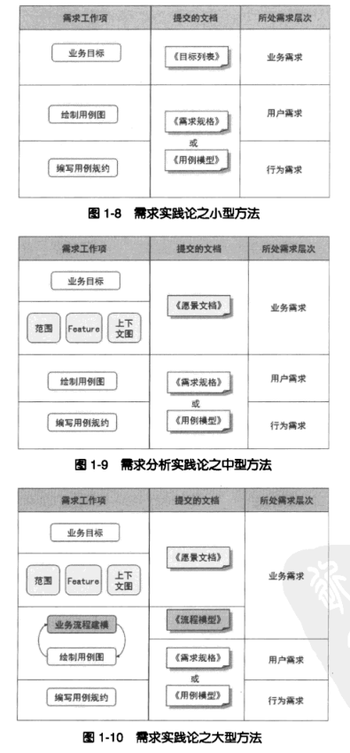

## 关键词
- 逻辑视图，物理视图
- 模块划分：功能模块，分层架构，用例驱动的模块划分，水平，垂直，用例到类再到模块
- 分而治之，迭代式设计
- 关键需求
- 需求：流程，功能，非功能
- 业务需求，用户需求，行为需求
- 概念架构（市场架构）

## 架构设计全过程

- STEP 1: 高层需求分析：系统目标，需求范围，Feature，上下文图
- STEP 2: 需求分析：流程 + 功能 + 非功能
- STEP 3: 概念架构（市场架构）设计：关键需求 + 划分顶级子系统 + 架构风格 + 技术选型（开发，集成，二次开发）
- STEP 4: 细化架构设计

### 需求实践论的3套方法

### 概念架构（市场架构）设计

#### 如何划分顶级子系统？
可以从不同的维度划分子系统
- 前端系统，后端系统
- 库存系统，订单系统，支付系统
- 认证系统，日志系统，监控系统，消息队列，存储系统，数据分析
- 用户数据，产品数据

####  架构风格具体指什么？
来自通义千问的答案：
- 单体架构：所有功能都紧密集成在一个单一的应用程序中。
- 微服务架构：应用程序由多个小型、独立的服务组成，每个服务实现特定业务功能。
- 客户端-服务器架构：一个或多个客户端应用程序通过网络请求从一个或多个服务器上获取数据和服务。
- 事件驱动架构 (EDA)：系统组件通过事件进行异步通信。
- 分层架构：系统被划分为不同的层次，每一层只与紧邻的层交互。
- 服务导向架构 (SOA)：基于服务之间的松耦合通信，通常使用标准的消息传递协议。
- 领域驱动设计 (DDD)：专注于复杂业务领域的建模，强调业务逻辑和技术架构的紧密结合。

#### 开发技术选型
- 语言，框架，数据库，工具，中间件，云平台，容器技术，CICD，大数据技术

#### 集成技术选型？
- 通过API 或 SDK
- 通过消息队列
- 通过数据库复制和同步

#### 二次开发技术选型？
- 插件
- SDK 或 API
- 脚本(python, javascript)
- 修改配置

## 扩展知识

#### 特性和功能需求有啥不同？
- 特性Feature：面向用户的功能集合。
- 功能需求 (Functional Requirements)：面向系统的功能。
- 比如：一键下单特性，包含了身份验证、地址确认、支付处理等功能。