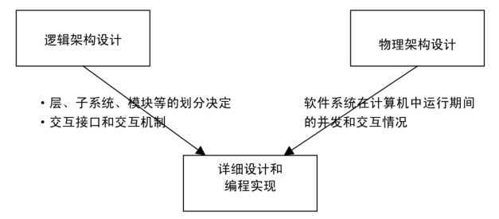
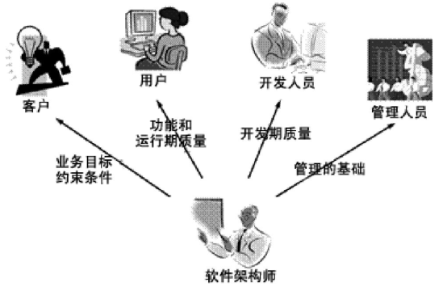
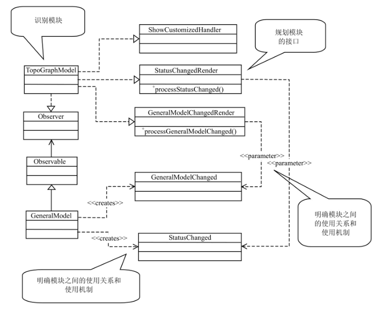
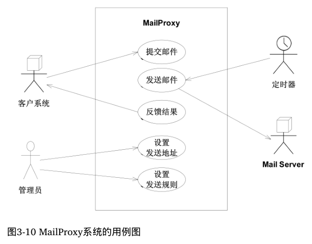
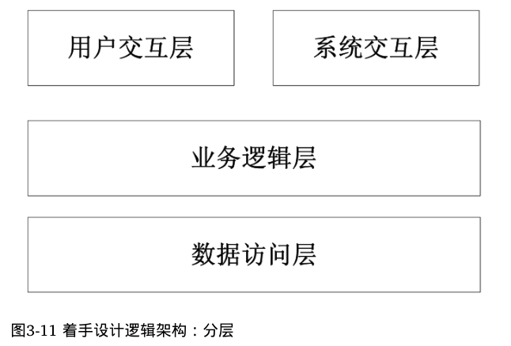
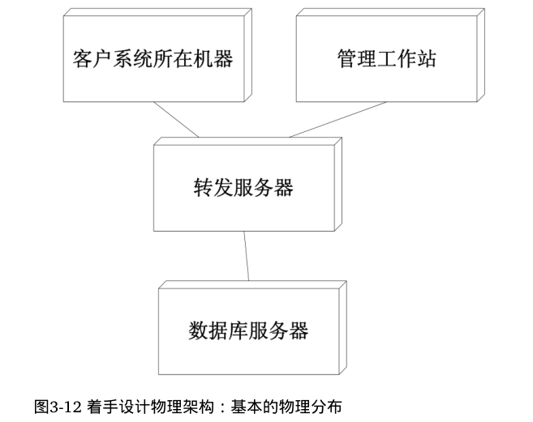
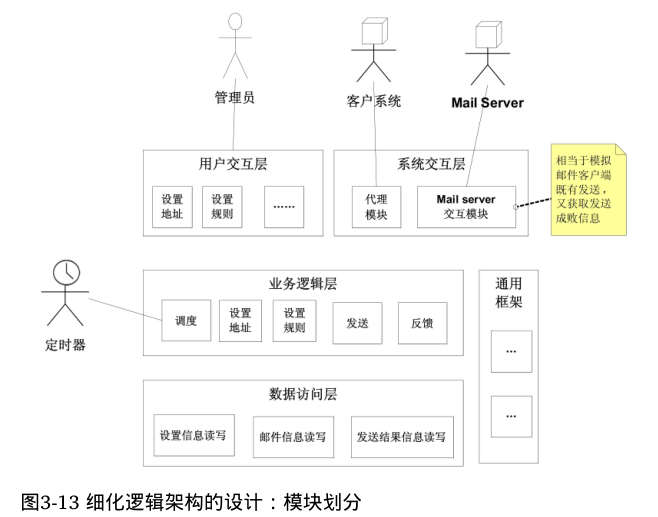
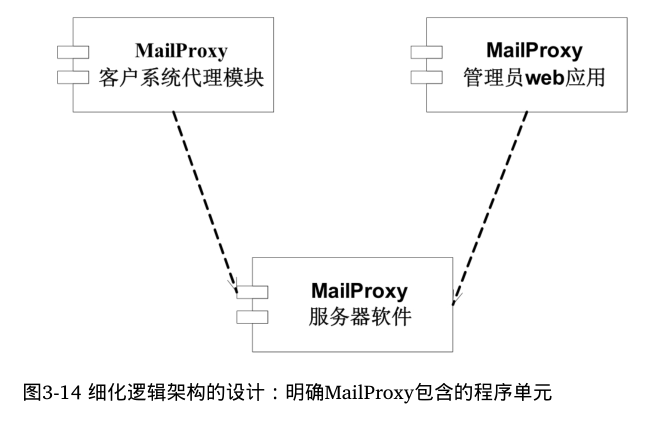
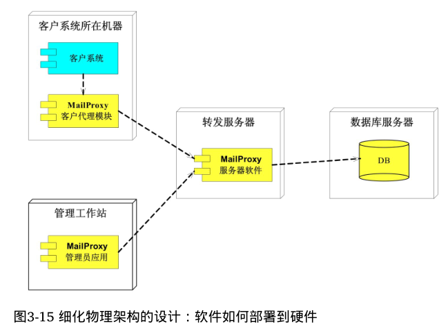

## 架构视图
- 物理视图：比如所有的服务器物理视图上都一样，都是连接到路由器上。
- 逻辑视图：有些服务器可能是文件服务器，有些是客户机。

## 架构师应当为项目相关的不同角色而设计

## 逻辑架构
关注逻辑元素，明确模块和接口，明确模块之间的关系

## 物理架构
- 关注物理元素，及之间的关系，以及部署。
- 物理元素：如进程，线程，对象，
- 动态行为：进程调度，线程同步，相互通信。

## 实际案例（迭代1）

## 实际案例（迭代2）

