## 金句
- “关键需求”决定“概念架构”。
- 通过多视图方法“细化架构”，通过“架构原型”验证架构。、
- 软件架构师就应该是领域建模活动的领导者，这样可以避免“不同阶段领域模型由不同人负责”所带来的问题。

## 6个步骤
- 需求分析
- 领域建模
- 确定关键需求
- 概念架构设计
- 细化架构设计
- 架构验证

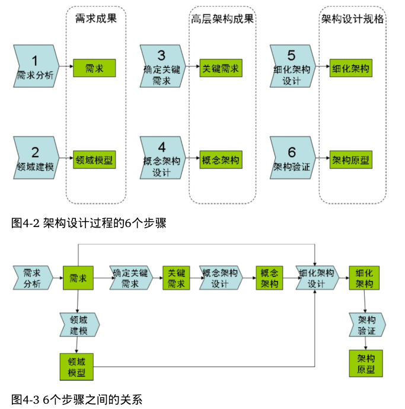

#### 需求分析
“范围+Feature+上下文图”三剑客

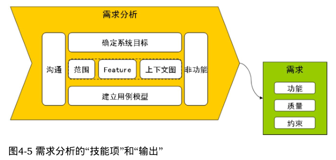

#### 领域建模
领域建模实践的精髓是“业务决定功能，功能决定模型”

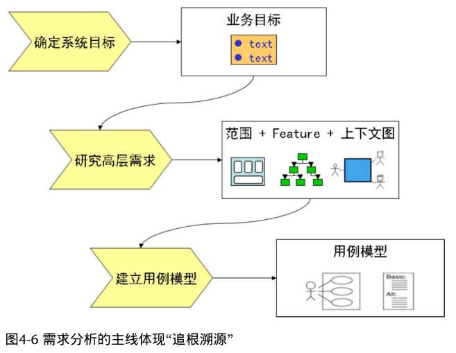

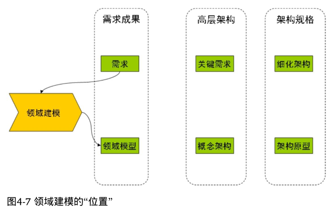

#### 确定关键需求
关键需求决定了架构的大方向。

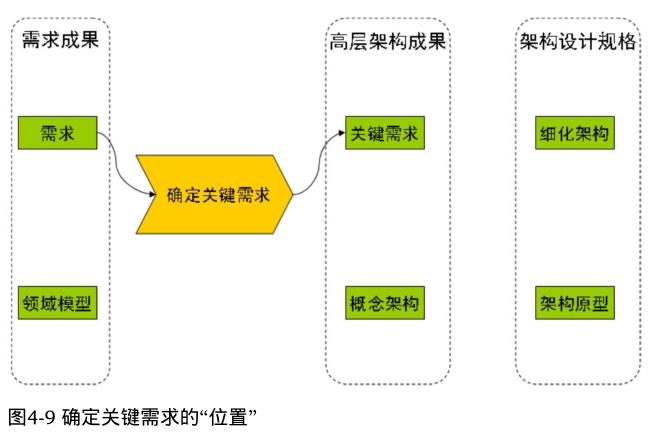

#### 概念架构设计
概念架构要明确给出“1 个决定 4 个选型”，即决定：
- 如何划分顶级子系统；
- 架构风格选型；
- 开发技术选型；
- 集成技术选型；
- 二次开发技术选型。

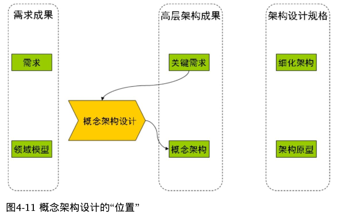

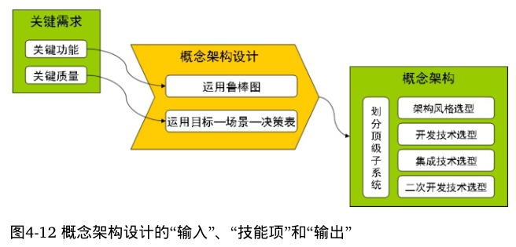

#### 细化架构设计
细化架构和概念架构的关键区别之一是：概念架构没有设计到“模块+接口”一级，而细化架构必须关注“模块+接口”。  
“领域模型”，一方面影响着“逻辑架构视图”的“领域模型设计”，另一方面影响着“数据架构视图”的“存储格式设计”
- 逻辑架构
- 开发架构
- 运行架构
- 物理架构
- 数据架构

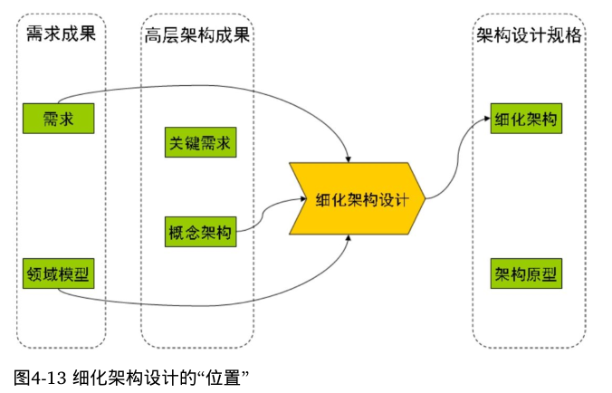

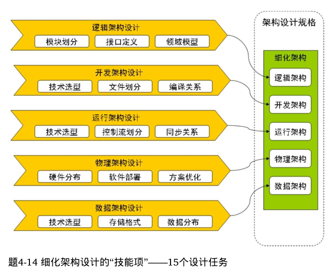

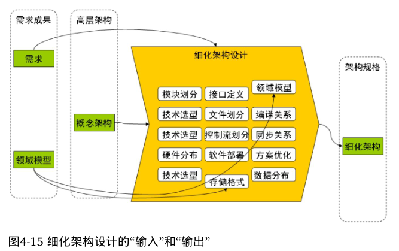

#### 架构验证
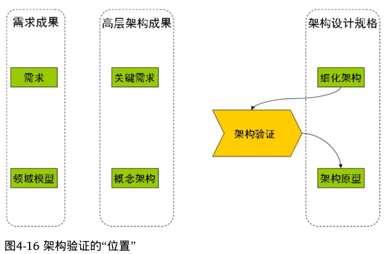

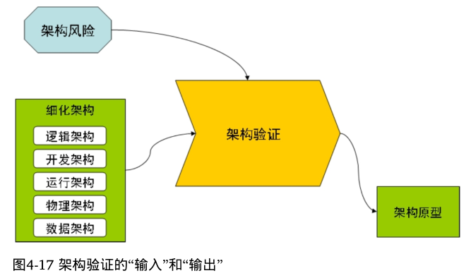

## 问题：什么是鲁棒图？
- 鲁棒图包含3中元素，它们分别是边界对象、控制对象、实体对象。
- 边界对象对模拟外部环境和内部系统之间的交互进行建模。边界对象负责接收外部输入，处理内部内容的解释，并表达或传递相应的结果。
- 控制对象对行为进行封装，描述用例中事件流的控制行为。
- 实体对象对信息进行描述，它往往来自领域概念和领域模型中的对象有良好的对应关系。

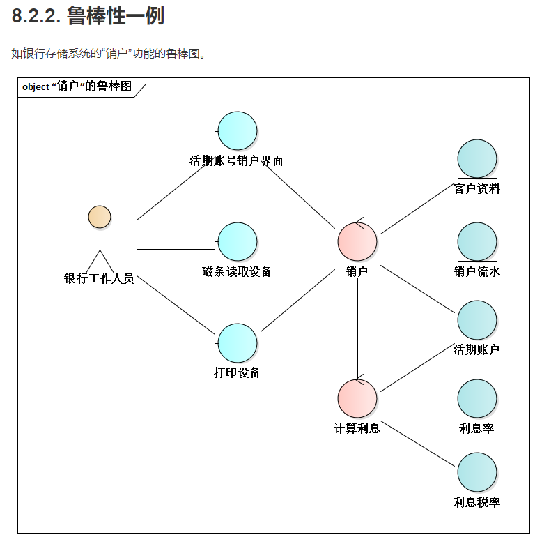

参考：https://tonydeng.github.io/architect-manual/ch8/8.2.html