## 愿景分析
愿景 = 业务目标 + 范围 + Feature + 上下文图

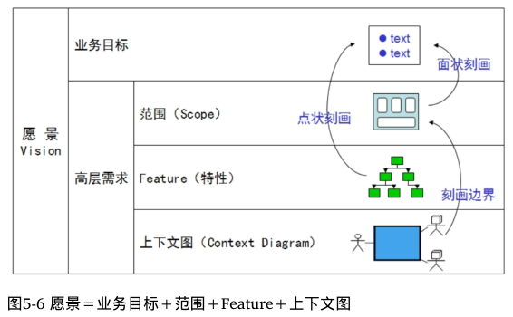

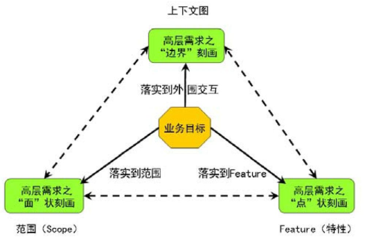

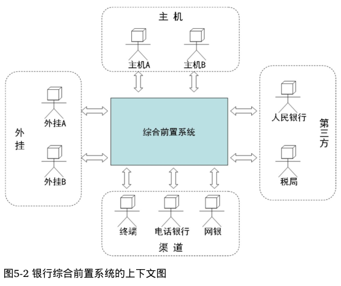

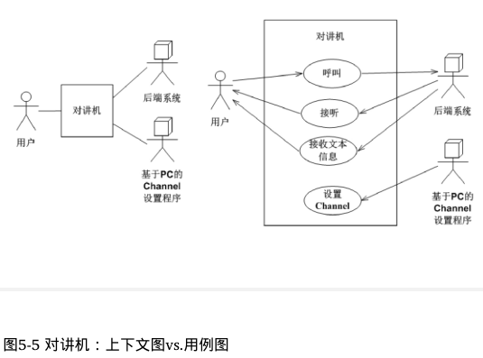

## 需求分析

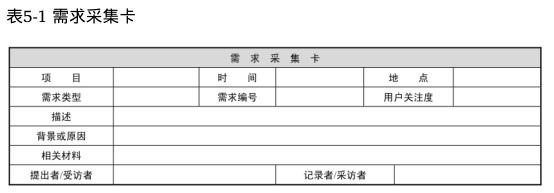

需求分析应交付一份明确的、规范的需求定义——《软件需求规格说明书》（Software Requirements Specification，SRS）。

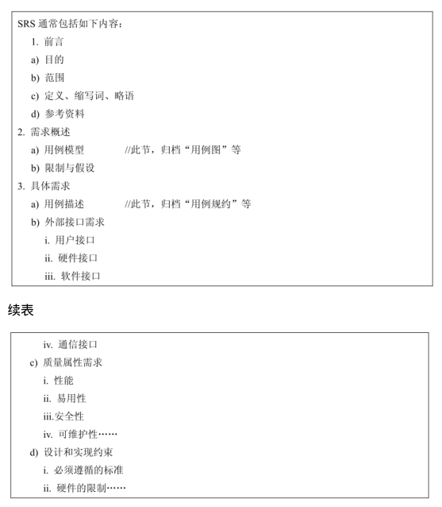

## 掌握的需求全不全

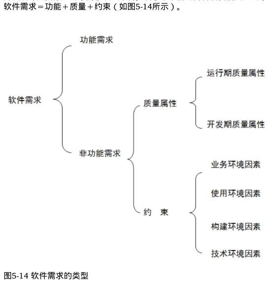

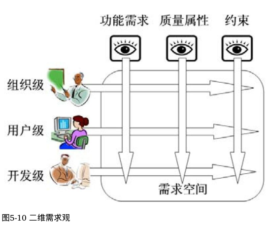

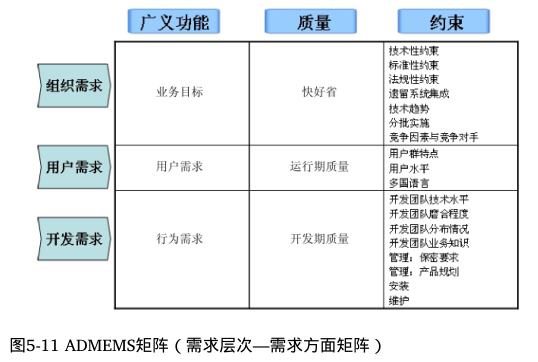

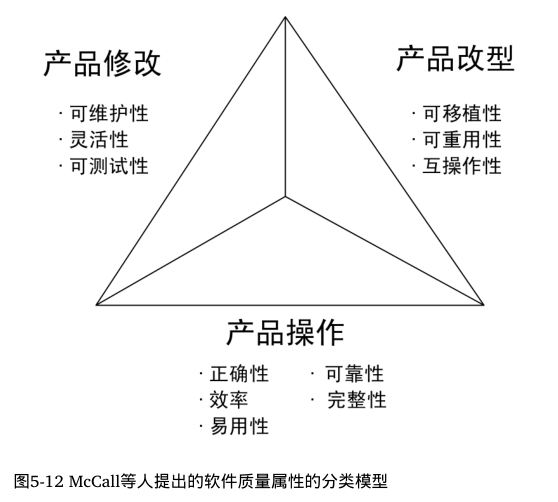

约束需求=业务环境因素+使用环境因素+构建环境因素+技术环境因素。

## 从需求向设计转换的密码

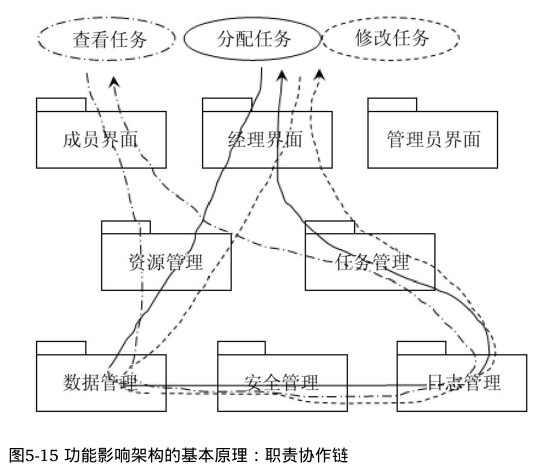

质量：是完善架构设计的驱动力，不考虑质量的系统是无法走出实验室的。

约束：设计并不自由。对于架构设计而言，来自方方面面的约束性需求中潜藏了大量风险因素。

## 实例应用

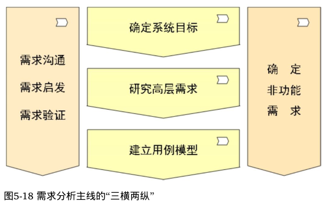

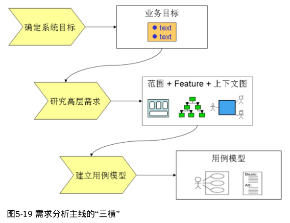

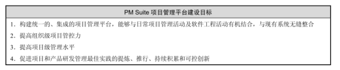

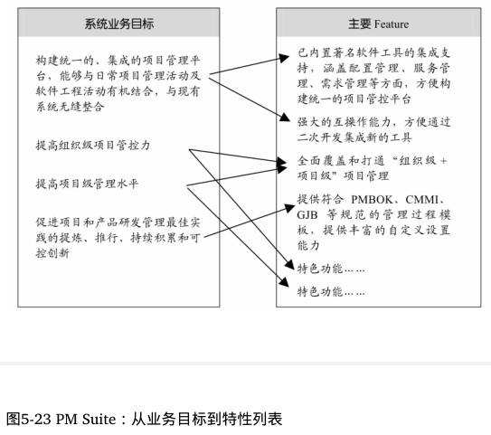

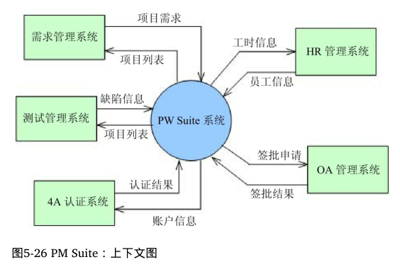

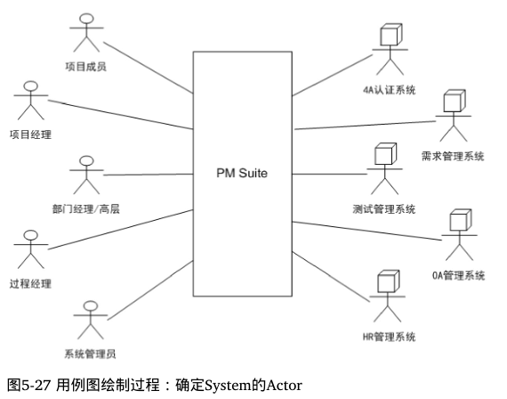

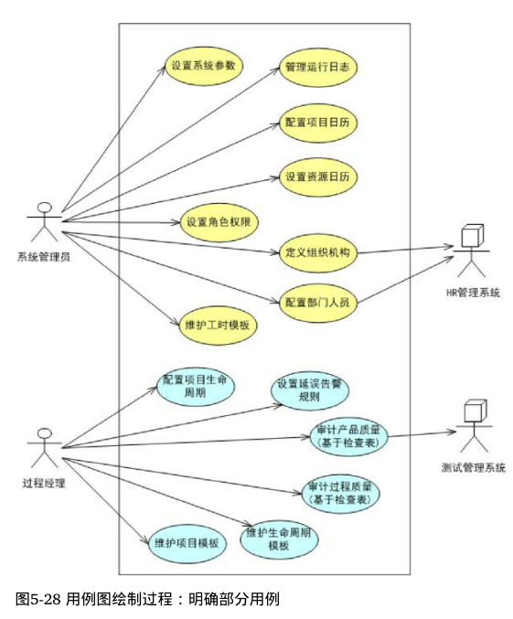

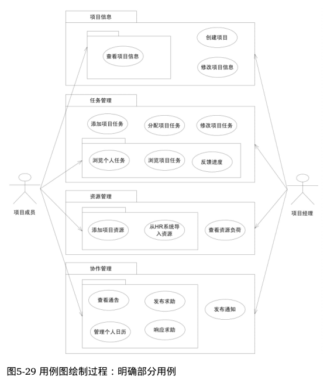

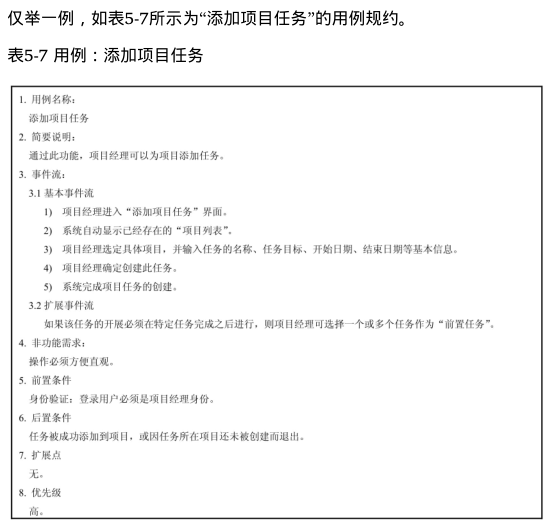

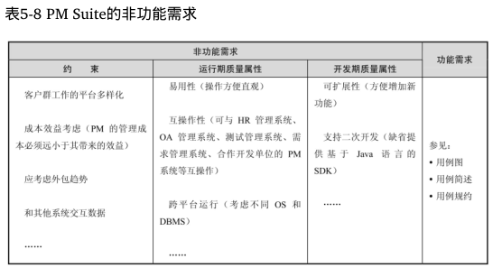